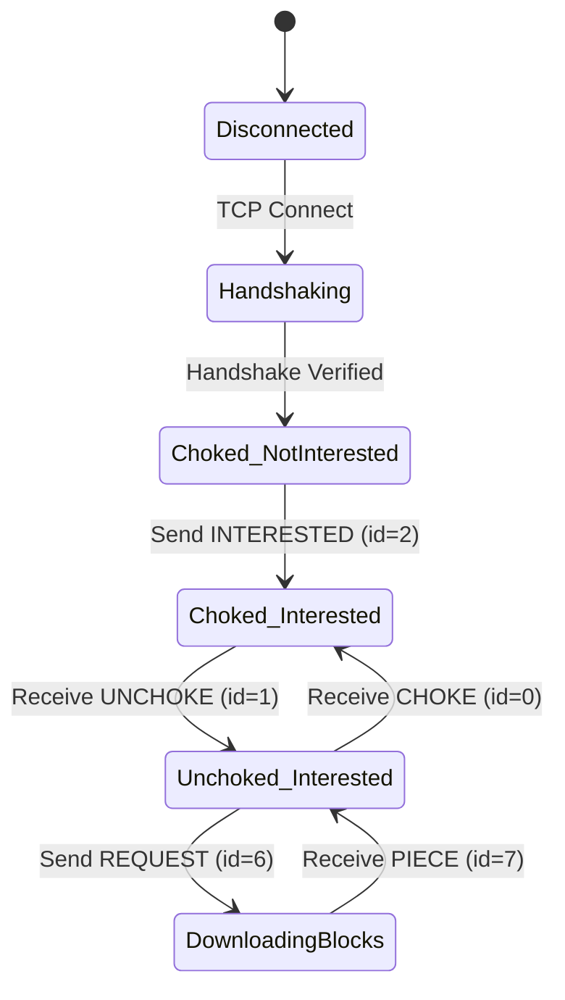
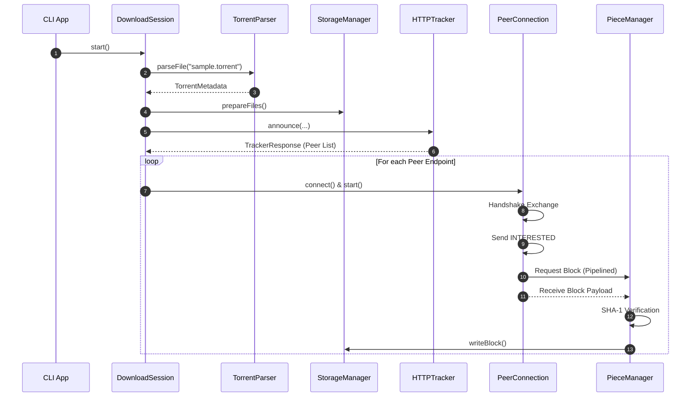

# Complete Educational Guide to BitTorrent & Distributed Systems in C++20

Welcome to the **BitTorrent Client Educational Guide**. This document assumes you are encountering distributed systems, peer-to-peer (P2P) networking, binary protocol state machines, and asynchronous I/O in C++ for the first time.

---

## Table of Contents
1. [Core Concepts of BitTorrent & Distributed Systems](#1-core-concepts-of-bittorrent--distributed-systems)
   - [Centralized vs. Peer-to-Peer (P2P) Systems](#centralized-vs-peer-to-peer-p2p-systems)
   - [Swarm Architecture: Seeds, Leechers, and Trackers](#swarm-architecture-seeds-leechers-and-trackers)
   - [Files, Pieces, and 16KB Blocks](#files-pieces-and-16kb-blocks)
2. [Bencoding Serialization Protocol](#2-bencoding-serialization-protocol)
   - [Bencode Data Types](#bencode-data-types)
   - [Bencode Parsing & Encoding Mechanics](#bencode-parsing--encoding-mechanics)
3. [Cryptographic Verification (SHA-1)](#3-cryptographic-verification-sha-1)
   - [Why SHA-1 Verification Exists](#why-sha-1-verification-exists)
   - [Info Hash Computation](#info-hash-computation)
4. [Tracker Protocol & Peer Discovery](#4-tracker-protocol--peer-discovery)
   - [HTTP Announce Protocol](#http-announce-protocol)
   - [Compact Peer Representation](#compact-peer-representation)
5. [Peer Wire Protocol & State Machine](#5-peer-wire-protocol--state-machine)
   - [Handshake Protocol](#handshake-protocol)
   - [Wire Framing & Message Format](#wire-framing--message-format)
   - [Peer Choking & Interest State Machine](#peer-choking--interest-state-machine)
   - [Block Request Pipelining](#block-request-pipelining)
6. [Piece Selection & Disk Storage](#6-piece-selection--disk-storage)
   - [Rarest-First Selection Algorithm](#rarest-first-selection-algorithm)
   - [Multi-File Storage Offset Translation](#multi-file-storage-offset-translation)
   - [Fast-Resume Persistence](#fast-resume-persistence)
7. [Asynchronous Networking Engine (Boost.Asio)](#7-asynchronous-networking-engine-boostasio)
   - [Event Loop & Multi-threaded Worker Thread Pool](#event-loop--multi-threaded-worker-thread-pool)
   - [Non-blocking Socket Reads/Writes & Timers](#non-blocking-socket-readswrites--timers)
8. [Comprehensive Codebase Tour (Namespaces, Classes & Files)](#8-comprehensive-codebase-tour)
9. [Architecture & Sequence Diagrams](#9-architecture--sequence-diagrams)

---

## 1. Core Concepts of BitTorrent & Distributed Systems

### Centralized vs. Peer-to-Peer (P2P) Systems
In traditional client-server architecture (e.g. HTTP web servers), a single centralized server streams files to multiple clients. As the number of concurrent clients grows, server bandwidth demands scale linearly until network link capacity is exhausted.

BitTorrent inverts this relationship using a **Peer-to-Peer (P2P) Overlay Network**. Every downloading client (*Leecher*) also acts as an uploading server (*Seeder*) for pieces it has already acquired and verified. Bandwidth capacity scales dynamically with the size of the swarm.

### Swarm Architecture: Seeds, Leechers, and Trackers
- **Swarm**: The group of all peers participating in the transfer of a specific torrent dataset.
- **Seeder**: A peer that possesses 100% of the torrent data and uploads blocks to other peers.
- **Leecher**: A peer actively downloading missing pieces while uploading available pieces to others.
- **Tracker**: A central HTTP service that tracks peer IP/Port endpoints within a swarm without hosting actual file data.

### Files, Pieces, and 16KB Blocks
BitTorrent divides datasets into fixed-size chunks called **Pieces** (typically 256KB to 4MB).
To allow concurrent streaming over TCP sockets without excessive memory overhead, pieces are further subdivided into **Blocks** (standardized at `16384` bytes / 16KB).

```text
+-----------------------------------------------------------------------+
|                            Torrent Dataset                            |
+-----------------------------------+-----------------------------------+
|             Piece 0               |             Piece 1               |
+---------+---------+---------+-----+---------+---------+---------+-----+
| Block 0 | Block 1 | Block 2 | ... | Block 0 | Block 1 | Block 2 | ... |
| (16 KB) | (16 KB) | (16 KB) |     | (16 KB) | (16 KB) | (16 KB) |     |
+---------+---------+---------+-----+---------+---------+---------+-----+
```

---

## 2. Bencoding Serialization Protocol

Bencoding is the native binary string serialization format used across `.torrent` files and HTTP tracker responses.

### Bencode Data Types
1. **Integer**: `i<integer>e`
   - Example: `i42e` represents `42`. `i-10e` represents `-10`.
2. **Byte String**: `<length>:<string>`
   - Example: `4:spam` represents `"spam"`.
3. **List**: `l<elements>e`
   - Example: `l4:spami42ee` represents `["spam", 42]`.
4. **Dictionary**: `d<key1><val1><key2><val2>...e`
   - Example: `d3:cow3:moo4:spam4:eggse` represents `{"cow": "moo", "spam": "eggs"}`.
   - **Crucial Rule**: Dictionary keys MUST be bencoded strings sorted lexicographically.

---

## 3. Cryptographic Verification (SHA-1)

### Why SHA-1 Verification Exists
In an untrusted P2P network, hostile or malfunctioning peers might send garbage or malicious bytes. BitTorrent solves this by computing a 20-byte SHA-1 hash for every piece during torrent creation.

When a client receives all 16KB blocks belonging to a piece, it hashes the assembled piece data using OpenSSL SHA-1 (`EVP_DigestInit_ex`) and compares the digest to the expected `piece_hashes` array from torrent metadata.

```text
[Received Blocks] --> Assemble Buffer --> SHA-1 Hash --> Compare with Metadata
                                                            |
                                      +---------------------+---------------------+
                                      |                                           |
                                 [Hash Match]                                [Hash Mismatch]
                                      |                                           |
                               Write to Disk                               Discard & Re-request
```

### Info Hash Computation
The **`info_hash`** is the 20-byte SHA-1 digest of the raw bencoded `info` dictionary inside the `.torrent` file. It serves as the unique global identifier for a torrent across trackers and peers.

---

## 4. Tracker Protocol & Peer Discovery

### HTTP Announce Protocol
Clients discover peers by sending an HTTP GET request to the tracker URL specified in the `.torrent` file:

```http
GET /announce?info_hash=%1F%E2%ED...&peer_id=-BT2000-123456789012&port=6881&uploaded=0&downloaded=0&left=1048576&compact=1&event=started HTTP/1.1
Host: tracker.example.com
```

### Compact Peer Representation
When `compact=1` is requested, the tracker returns peers as a raw binary string where every peer takes 6 bytes:
- 4 bytes: IPv4 Address (Big-Endian)
- 2 bytes: Port Number (Big-Endian)

---

## 5. Peer Wire Protocol & State Machine

### Handshake Protocol
Immediately upon opening a TCP connection to a peer, both sides exchange a 68-byte handshake:

```text
+----------+---------------------+------------------+-------------------+-------------------+
| pstrlen  | pstr (19 bytes)     | reserved (8 B)   | info_hash (20 B)  | peer_id (20 B)    |
| (1 byte) | "BitTorrent protocol"| 0x00...0x00      | Cryptographic ID  | Client ID         |
+----------+---------------------+------------------+-------------------+-------------------+
```

### Wire Framing & Message Format
All post-handshake wire messages share a common header:

```text
+-------------------------+--------------------+------------------------+
| Length Prefix (4 bytes) | Message ID (1 byte)| Payload (N bytes)      |
| Big-Endian integer      | Message Type Enum  | Optional message data  |
+-------------------------+--------------------+------------------------+
```

### Peer Choking & Interest State Machine
Each peer connection maintains two independent bi-directional boolean states:

1. **`am_choking`**: Client is choking peer (refusing upload requests).
2. **`am_interested`**: Client wants pieces owned by peer.
3. **`peer_choking`**: Peer is choking client (refusing download requests).
4. **`peer_interested`**: Peer wants pieces owned by client.



### Block Request Pipelining
To prevent socket starvation over high-latency network links, the client maintains **Pipelining** (up to 5 concurrent block requests in-flight per peer connection) rather than waiting for each block individually.

---

## 6. Piece Selection & Disk Storage

### Rarest-First Selection Algorithm
The `RarestFirstSelector` tracks piece availability counters across all connected peers' bitfield representations. When selecting a piece to request, it picks pieces with the lowest global availability (rarest) first, randomly breaking ties to avoid request collisions across peers.

### Multi-File Storage Offset Translation
In multi-file torrents, pieces span across file boundaries. `StorageManager` translates global byte offsets `(piece_index * piece_length + block_offset)` into relative file paths and seek offsets on disk:

```text
Global Offset Range: [0 ........................................ 5,000,000 Bytes]
Files on Disk:       [ File 1 (2 MB) ] [   File 2 (2 MB)   ] [ File 3 (1 MB) ]
```

### Fast-Resume Persistence
When downloading progresses, verified piece completion states are written to `.fastresume` bencoded state files on disk, preventing re-verification on client restart.

---

## 7. Asynchronous Networking Engine (Boost.Asio)

### Event Loop & Multi-threaded Worker Thread Pool
`IOContextPool` encapsulates Boost.Asio's core `io_context` engine and executes `io_context.run()` across a thread pool of C++20 `std::jthread` instances, dispatching socket I/O events concurrently without lock contention.

---

## 8. Comprehensive Codebase Tour

### Core Namespaces
- `bittorrent::utils`: Thread-safe Logger, Hex conversions, byte ordering, CLI progress UI.
- `bittorrent::crypto`: SHA-1 OpenSSL EVP wrapper.
- `bittorrent::parser`: BencodeValue variant, recursive descent parser, and encoder.
- `bittorrent::torrent`: TorrentMetadata structures, file parsers, resume persistence, session manager.
- `bittorrent::piece`: Block structures, StorageManager I/O, PieceManager, RarestFirstSelector.
- `bittorrent::tracker`: Tracker responses, HTTPTracker client.
- `bittorrent::peer`: Handshake framing, PeerMessage, PeerConnection state machine.
- `bittorrent::network`: IOContextPool multi-threaded runner.
- `bittorrent::cli`: Command line argument parser.

---

## 9. Architecture & Sequence Diagrams

### Complete Download Execution Flow


